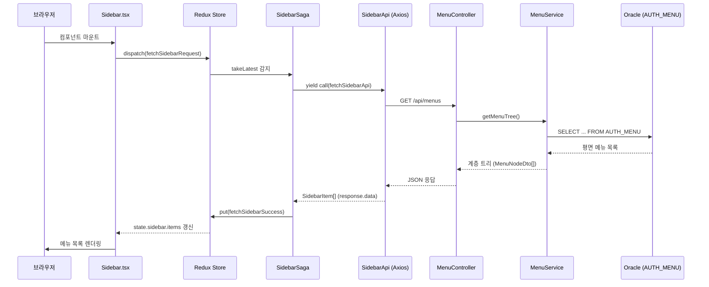

# 사이드바 데이터 흐름 — `npm run dev`부터 백엔드까지

> **범위:** 프론트엔드(`hospital-project`)와 백엔드(`hospital-backend`) 전체  
> **핵심 API:** `GET http://localhost:8081/api/menus`

---

## 1. 전체 구조 한눈에 보기

브라우저에서 페이지를 열면 **React 컴포넌트 → Redux → Saga → Axios → Spring Boot → MyBatis → Oracle DB** 순으로 메뉴 데이터가 흐릅니다.



---

## 2. 사전 준비 — 두 서버가 모두 떠 있어야 함

| 서버 | 실행 명령 | 포트 | 역할 |
|------|-----------|------|------|
| **프론트** | `npm run dev` | `3000` | Next.js UI |
| **백엔드** | Spring Boot 실행 (`HospitalApplication`) | `8081` | REST API + DB |

- 프론트 Axios `baseURL`: `http://localhost:8081` (기본값, `.env.local`의 `NEXT_PUBLIC_API_URL`로 변경 가능)
- 백엔드 DB: Oracle XE `localhost:1521:XE`, 스키마 `CMH.AUTH_MENU`
- CORS: 백엔드가 `http://localhost:3000` 요청을 허용하도록 설정됨

---

## 3. Phase 1 — `npm run dev` (프론트 서버 기동)

### 3.1 명령 실행

```bash
cd hospital-project
npm run dev
```

`package.json`의 `dev` 스크립트는 **`next dev`** 를 실행합니다.

```
package.json
  └─ "dev": "next dev"
       └─ Next.js 16 개발 서버 시작 (기본 http://localhost:3000)
```

### 3.2 Next.js가 하는 일

1. `src/app` 디렉터리 기준으로 **App Router** 라우팅 구성
2. Turbopack/Webpack으로 React 컴포넌트 번들링
3. 브라우저가 `http://localhost:3000` 접속 시 서버/클라이언트 컴포넌트 렌더링 시작

---

## 4. Phase 2 — React 앱 부트스트랩 (컴포넌트 트리)

브라우저가 `/` 페이지를 요청하면 아래 순서로 컴포넌트가 조립됩니다.

```
html (layout.tsx)
 └─ body
     └─ Providers.tsx          ← Redux Provider, MUI Theme
         └─ MainLayout.tsx      ← Sidebar + Nav + children
             ├─ Sidebar.tsx    ← ★ 여기서 메뉴 API 호출 트리거
             └─ Nav + page.tsx (children)
```

### 4.1 `src/app/layout.tsx` — 루트 레이아웃

- 모든 페이지에 공통 적용
- `Providers`로 Redux/MUI 감싸기
- `MainLayout`으로 Sidebar + 콘텐츠 영역 고정

```tsx
<Providers>
  <MainLayout>{children}</MainLayout>
</Providers>
```

### 4.2 `src/app/Providers.tsx` — Client Component

- `"use client"` — 브라우저에서 실행
- `<Provider store={store}>` — Redux store를 앱 전체에 주입
- MUI `ThemeProvider`, `CssBaseline` 설정

### 4.3 `src/components/layout/MainLayout.tsx`

- 좌측: `<Sidebar width={240} />`
- 우측: `<Nav />` + `{children}` (페이지 본문)
- **Sidebar는 모든 페이지에서 항상 마운트** → 페이지 이동해도 사이드바는 유지

---

## 5. Phase 3 — Redux Store + Saga 미들웨어 초기화

`Providers.tsx`가 `store`를 import하는 순간, **모듈 로드 시점**에 아래가 실행됩니다.

**파일:** `src/store/Store.ts`

```ts
const sagaMiddleware = createSagaMiddleware();

export const store = configureStore({
  reducer: {
    nav: navReducer,
    sidebar: sidebarReducer,   // 사이드바 상태
  },
  middleware: (getDefaultMiddleware) =>
    getDefaultMiddleware({ thunk: false }).concat(sagaMiddleware),
});

sagaMiddleware.run(rootSaga);  // ★ 앱 시작 시 saga 등록
```

### 5.1 초기 sidebar 상태

**파일:** `src/features/sidebar/SidebarSlice.ts`

| 필드 | 초기값 | 의미 |
|------|--------|------|
| `items` | `[]` | 메뉴 목록 |
| `loading` | `false` | 로딩 중 |
| `error` | `null` | 에러 메시지 |

### 5.2 Root Saga 등록

**파일:** `src/store/RootSaga.ts`

```ts
export default function* rootSaga() {
  yield all([fork(watchSidebarSaga)]);
}
```

- `watchSidebarSaga`가 **백그라운드에서 계속 실행**
- `fetchSidebarRequest` 액션이 dispatch되면 `fetchSidebarSaga` 실행

---

## 6. Phase 4 — Sidebar 마운트 & API 호출 트리거

**파일:** `src/components/sidebar/Sidebar.tsx`

### 6.1 Redux 상태 구독

```tsx
const { items, loading, error } = useSelector(
  (state: RootState) => state.sidebar,
);
```

### 6.2 마운트 시 액션 dispatch (핵심 트리거)

```tsx
React.useEffect(() => {
  dispatch(fetchSidebarRequest());
}, [dispatch]);
```

- Sidebar가 **처음 DOM에 올라올 때 1회** 실행
- `fetchSidebarRequest()` 액션이 Redux store로 전달됨

### 6.3 Slice에서 상태 변경

`fetchSidebarRequest` reducer 실행:

```ts
fetchSidebarRequest(state) {
  state.loading = true;
  state.error = null;
}
```

→ UI에 **로딩 스피너** (`CircularProgress`) 표시

---

## 7. Phase 5 — Redux-Saga가 API 호출 처리

**파일:** `src/features/sidebar/SidebarSaga.ts`

### 7.1 Watcher — 액션 감시

```ts
export function* watchSidebarSaga() {
  yield takeLatest(fetchSidebarRequest.type, fetchSidebarSaga);
}
```

- `takeLatest`: 같은 액션이 **연속으로 여러 번** 오면 **이전 요청은 취소**, 마지막만 처리
- Sidebar가 remount되거나 중복 dispatch해도 안전

### 7.2 Worker — 실제 비동기 작업

```ts
function* fetchSidebarSaga() {
  try {
    const items: SidebarItem[] = yield call(fetchSidebarApi);
    yield put(fetchSidebarSuccess(items));
  } catch {
    yield put(fetchSidebarFailure("사이드바 로드 실패"));
  }
}
```

| `yield` 표현 | 의미 |
|--------------|------|
| `yield call(fetchSidebarApi)` | `fetchSidebarApi()` Promise 실행 → **resolve 값**을 `items`에 할당 |
| `yield put(fetchSidebarSuccess(items))` | Redux에 success 액션 dispatch |

> **왜 saga에서 `.data`를 안 쓰나?**  
> `fetchSidebarApi()`가 내부에서 이미 `return response.data`로 **배열만 반환**하기 때문입니다.  
> saga는 함수의 **return 값**을 받습니다.

### 7.3 Success / Failure 후 Slice 상태

**Success:**

```ts
fetchSidebarSuccess(state, action) {
  state.loading = false;
  state.items = action.payload;  // 메뉴 배열 저장
}
```

**Failure:**

```ts
fetchSidebarFailure(state, action) {
  state.loading = false;
  state.error = action.payload;
}
```

---

## 8. Phase 6 — Axios HTTP 요청 (프론트 → 백엔드)

### 8.1 API 함수

**파일:** `src/lib/api/SidebarApi.ts`

```ts
export async function fetchSidebarApi(): Promise<SidebarItem[]> {
  const response = await api.get<SidebarItem[]>("/api/menus");
  return response.data;
}
```

### 8.2 Axios 인스턴스

**파일:** `src/lib/Axios.ts`

```ts
export const api = axios.create({
  baseURL: process.env.NEXT_PUBLIC_API_URL ?? "http://localhost:8081",
});
```

### 8.3 실제 HTTP 요청

```
GET http://localhost:8081/api/menus
Accept: application/json
Origin: http://localhost:3000
```

- Next.js 프록시 없음 → **브라우저에서 백엔드로 직접** cross-origin 요청
- 따라서 백엔드 CORS 설정 필수

### 8.4 프론트 타입

**파일:** `src/features/sidebar/SidebarTypes.ts`

```ts
export type SidebarItem = {
  id: number;
  code: string;
  name: string;
  path: string | null;
  icon: string | null;
  children: SidebarItem[];
};
```

백엔드 `MenuNodeDto` JSON과 1:1 대응합니다.

---

## 9. Phase 7 — Spring Boot 백엔드 처리

> 백엔드는 별도로 `HospitalApplication.main()` 실행 후 **8081 포트**에서 대기 중이어야 합니다.

### 9.1 애플리케이션 진입점

**파일:** `hospital-backend/src/main/java/com/hospital/HospitalApplication.java`

```java
@SpringBootApplication
@MapperScan("com.hospital.menu")
public class HospitalApplication {
    public static void main(String[] args) {
        SpringApplication.run(HospitalApplication.class, args);
    }
}
```

- `@MapperScan`: MyBatis `MenuMapper` 인터페이스 스캔
- `application.yml` → `server.port: 8081`

### 9.2 CORS — 프론트 요청 허용

**파일:** `WebConfig.java` + `MenuController`의 `@CrossOrigin`

- `/api/**` 경로에 `localhost:3000` origin 허용
- `OPTIONS` preflight 포함

### 9.3 Controller — HTTP 엔드포인트

**파일:** `MenuController.java`

```java
@RestController
@RequestMapping("/api/menus")
public class MenuController {

    @GetMapping
    public List<MenuNodeDto> getMenus() {
        return menuService.getMenuTree();
    }
}
```

| 항목 | 값 |
|------|-----|
| URL | `GET /api/menus` |
| 응답 | `List<MenuNodeDto>` → JSON 배열 |
| Content-Type | `application/json` |

### 9.4 Service — 평면 목록 → 계층 트리 변환

**파일:** `MenuService.java`

```
1. menuMapper.selectAllMenus()  → DB에서 평면 List<Menu> 조회
2. buildTree(flatList, null)  → parentId 기준 재귀 트리 구성
3. sortOrder로 형제 메뉴 정렬
4. MenuNodeDto로 변환 (parentId, sortOrder는 응답에서 제외)
```

**트리 변환 로직 요약:**

```
parentId == null  → 최상위 루트 메뉴
parentId == 5     → id=5인 메뉴의 자식
각 노드.children  → buildTree(flatList, menu.getId()) 재귀
```

### 9.5 MyBatis — SQL 실행

**인터페이스:** `MenuMapper.java`  
**SQL XML:** `src/main/resources/mapper/MenuMapper.xml`

```sql
SELECT
    MENU_ID     AS id,
    PARENT_ID   AS parentId,
    CODE        AS code,
    NAME        AS name,
    PATH        AS path,
    ICON        AS icon,
    SORT_ORDER  AS sortOrder
FROM CMH.AUTH_MENU
WHERE IS_ACTIVE = 'Y'
ORDER BY SORT_ORDER
```

- `resultType="com.hospital.menu.Menu"` → Java `Menu` 엔티티로 매핑
- `map-underscore-to-camel-case: true` (application.yml)

### 9.6 DB 설정

**파일:** `application.yml`

```yaml
server:
  port: 8081

spring:
  datasource:
    url: jdbc:oracle:thin:@localhost:1521:XE
    username: hospital
    password: "1111"
    driver-class-name: oracle.jdbc.OracleDriver

mybatis:
  mapper-locations: classpath:mapper/*.xml
```

### 9.7 API 응답 JSON 예시

```json
[
  {
    "id": 1,
    "code": "DASHBOARD",
    "name": "대시보드",
    "path": "/dashboard",
    "icon": "Dashboard",
    "children": []
  },
  {
    "id": 2,
    "code": "PATIENT",
    "name": "환자 관리",
    "path": null,
    "icon": "People",
    "children": [
      {
        "id": 3,
        "code": "PATIENT_LIST",
        "name": "환자 목록",
        "path": "/patients",
        "icon": null,
        "children": []
      }
    ]
  }
]
```

---

## 10. Phase 8 — 응답이 UI까지 돌아오는 과정

```
Oracle DB
  ↓ List<Menu> (평면)
MenuService.buildTree()
  ↓ List<MenuNodeDto> (계층)
MenuController → JSON
  ↓ HTTP 200
Axios response.data → SidebarItem[]
  ↓
fetchSidebarSaga → put(fetchSidebarSuccess(items))
  ↓
Redux state.sidebar.items = [...]
  ↓
Sidebar.tsx useSelector 재렌더
  ↓
SidebarItem.tsx 재귀 렌더 (Link / Collapse)
```

### 10.1 Sidebar UI 렌더링 분기

**파일:** `Sidebar.tsx`

| 조건 | UI |
|------|-----|
| `loading === true` | `CircularProgress` |
| `error !== null` | 에러 메시지 |
| `items.length === 0` | "표시할 메뉴가 없습니다." |
| 그 외 | `items.map` → `SidebarItem` |

### 10.2 SidebarItem — 메뉴 항목 렌더

**파일:** `SidebarItem.tsx`

- **leaf + path 있음** → Next.js `<Link href={path}>`
- **자식 있음** → 클릭 시 `Collapse` 토글
- **depth 0 + icon** → `SidebarIcons` 맵에서 MUI 아이콘 표시

### 10.3 현재 경로에 맞는 자동 펼침

**파일:** `SidebarUtils.ts`

```tsx
React.useEffect(() => {
  if (!items.length) return;
  const autoOpenIds = getOpenIds(pathname, items);
  setOpenIds((prev) => [...new Set([...prev, ...autoOpenIds])]);
}, [pathname, items]);
```

현재 URL에 해당하는 메뉴의 **부모 id**를 찾아 자동으로 펼칩니다.

---

## 11. 타입 / 데이터 매핑表

| 레이어 | 타입 | 비고 |
|--------|------|------|
| DB | `CMH.AUTH_MENU` 컬럼 | `MENU_ID`, `PARENT_ID`, `CODE`, `NAME`, `PATH`, `ICON`, `SORT_ORDER` |
| MyBatis | `Menu` | `parentId`, `sortOrder` 포함 (내부용) |
| Service → API | `MenuNodeDto` | `children` 포함, `parentId`/`sortOrder` 제외 |
| Axios JSON | `SidebarItem[]` | 프론트 TypeScript 타입 |
| Redux | `state.sidebar.items` | `SidebarItem[]` |

---

## 12. 관련 파일 목록

### 프론트엔드 (`hospital-project`)

| 파일 | 역할 |
|------|------|
| `package.json` | `npm run dev` → `next dev` |
| `src/app/layout.tsx` | 루트 레이아웃 |
| `src/app/Providers.tsx` | Redux / MUI Provider |
| `src/components/layout/MainLayout.tsx` | Sidebar 포함 2단 레이아웃 |
| `src/components/sidebar/Sidebar.tsx` | 메뉴 로드 트리거 + UI |
| `src/components/sidebar/SidebarItem.tsx` | 재귀 메뉴 항목 |
| `src/components/sidebar/SidebarUtils.ts` | 활성 경로 / 자동 펼침 |
| `src/store/Store.ts` | Redux store + saga 미들웨어 |
| `src/store/RootSaga.ts` | saga 등록 |
| `src/features/sidebar/SidebarSlice.ts` | sidebar 상태 / 액션 |
| `src/features/sidebar/SidebarSaga.ts` | API 호출 side effect |
| `src/features/sidebar/SidebarTypes.ts` | `SidebarItem` 타입 |
| `src/lib/api/SidebarApi.ts` | `GET /api/menus` 호출 |
| `src/lib/Axios.ts` | Axios 인스턴스 (baseURL) |

### 백엔드 (`hospital-backend`)

| 파일 | 역할 |
|------|------|
| `HospitalApplication.java` | Spring Boot 진입점 |
| `MenuController.java` | `GET /api/menus` REST API |
| `MenuService.java` | 평면 → 트리 변환 |
| `MenuMapper.java` | MyBatis 매퍼 인터페이스 |
| `MenuMapper.xml` | `AUTH_MENU` SELECT SQL |
| `Menu.java` | DB 엔티티 |
| `MenuNodeDto.java` | API 응답 DTO |
| `WebConfig.java` | CORS 설정 |
| `application.yml` | 포트, DB, MyBatis 설정 |

---

## 13. 자주 막히는 지점 (트러블슈팅)

| 증상 | 원인 | 확인 |
|------|------|------|
| "사이드바 로드 실패" | 백엔드 미실행 / 포트 불일치 | `8081`에서 Spring Boot 실행 여부 |
| CORS 에러 (브라우저 콘솔) | origin 불일치 | `WebConfig`, `@CrossOrigin`에 `localhost:3000` 포함 여부 |
| 빈 메뉴 | DB 데이터 없음 | `AUTH_MENU`에 `IS_ACTIVE='Y'` row 존재 여부 |
| Network Error | Oracle DB 연결 실패 | `application.yml` DB 접속 정보, XE 실행 여부 |
| 로딩만 계속 | saga 미등록 | `Store.ts`에서 `sagaMiddleware.run(rootSaga)` 확인 |

---

## 14. 한 줄 요약

```
npm run dev
  → Next.js가 layout/Providers/MainLayout/Sidebar 렌더
  → Sidebar useEffect가 fetchSidebarRequest dispatch
  → Saga가 fetchSidebarApi() 호출
  → Axios GET localhost:8081/api/menus
  → Spring MenuController → MenuService → MyBatis → Oracle
  → JSON 트리가 Redux items에 저장
  → Sidebar가 메뉴 목록 표시
```
